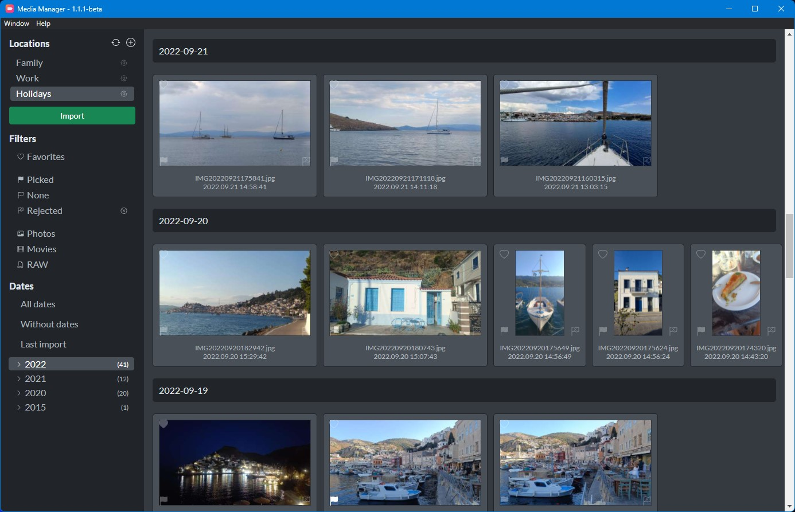

# Media Manager

A tool for simple managing photos and videos.

## Features
* Reads almost all video and photo files format (CR3 included)
* Preview most of the formats
* **Prevent add a duplicated file**
* Import and synchronizing folder
* Many folder locations
* Filter by:
    * date
    * file type
    * last import
    * favorites
    * locations
* Mark as favorite
* Mark by flags
* Remove all rejected items by one click

## Download
Go to [release page](https://github.com/Media-Manager-Soft/media-manager/releases) and choose current version.

## Contribution
If you want to contribute this project, start a 
[discussion](https://github.com/Media-Manager-Soft/media-manager/discussions).

If you found a bug please submit it [here](https://github.com/Media-Manager-Soft/media-manager/issues/new)

## License
MIT
